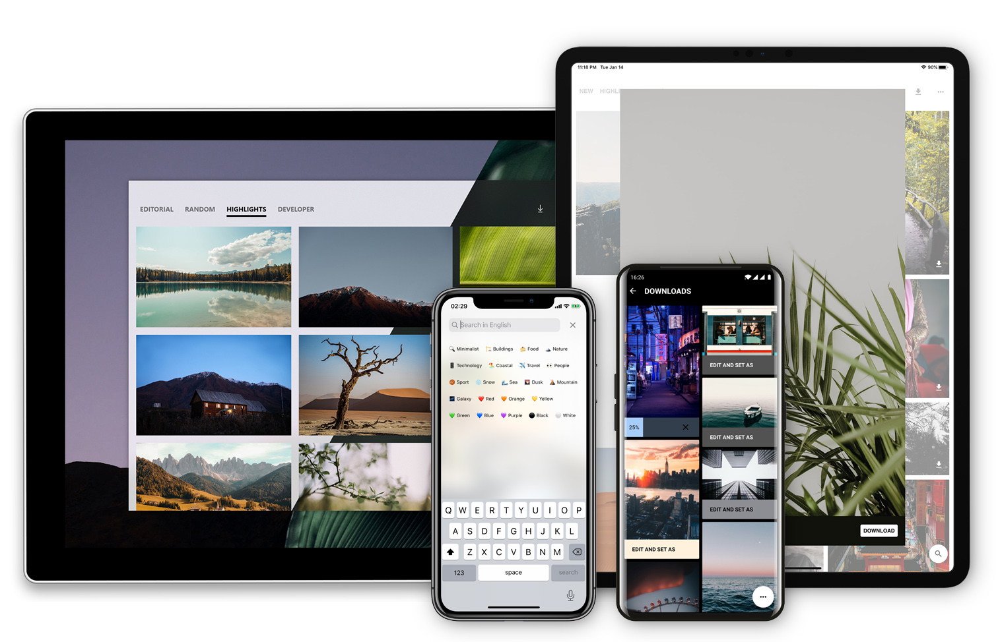

# MyerSplash for Android



## Introduction
Yet anothor simple and elegant photos & wallpaper app for all platforms.

Welcome to visit the [UWP](https://github.com/JuniperPhoton/MyerSplash.UWP) and [iOS](https://github.com/JuniperPhoton/MyerSplash.iOS) version :)

## Download

Visit the [website](https://juniperphoton.dev/myersplash/) to download all versions.

## Building

MyerSplash for Android is a standard Android gradle project. Just open it with Android Studio and see what will happen.

Welcome to use CLI to build the apk:

```
./gradlew clean :app:assembleDebug
```

Note that in order to access the unsplash API, you must:

- Register as developer in unsplash.com
- Copy your app secret key

Then in your `local.properties`:

```
unsplashKey=xxxx
appcenterKey=xxx
```

This app uses Microsoft's AppCenter to do the analysis, thus you should also have the appcenterKey too.

## License 
The project is released under MIT License.

MIT License

Copyright (c) 2020 JuniperPhoton

Permission is hereby granted, free of charge, to any person obtaining a copy
of this software and associated documentation files (the "Software"), to deal
in the Software without restriction, including without limitation the rights
to use, copy, modify, merge, publish, distribute, sublicense, and/or sell
copies of the Software, and to permit persons to whom the Software is
furnished to do so, subject to the following conditions:

The above copyright notice and this permission notice shall be included in all
copies or substantial portions of the Software.

THE SOFTWARE IS PROVIDED "AS IS", WITHOUT WARRANTY OF ANY KIND, EXPRESS OR
IMPLIED, INCLUDING BUT NOT LIMITED TO THE WARRANTIES OF MERCHANTABILITY,
FITNESS FOR A PARTICULAR PURPOSE AND NONINFRINGEMENT. IN NO EVENT SHALL THE
AUTHORS OR COPYRIGHT HOLDERS BE LIABLE FOR ANY CLAIM, DAMAGES OR OTHER
LIABILITY, WHETHER IN AN ACTION OF CONTRACT, TORT OR OTHERWISE, ARISING FROM,
OUT OF OR IN CONNECTION WITH THE SOFTWARE OR THE USE OR OTHER DEALINGS IN THE
SOFTWARE.

